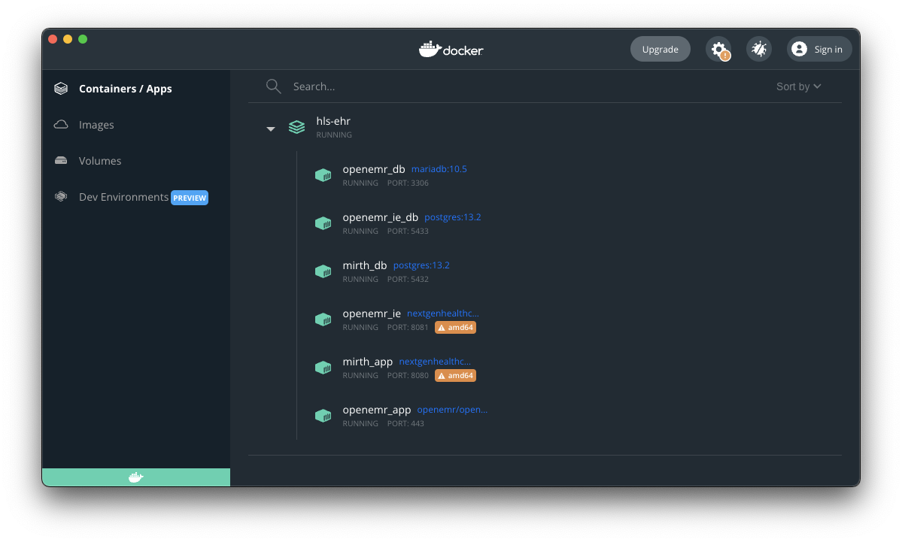
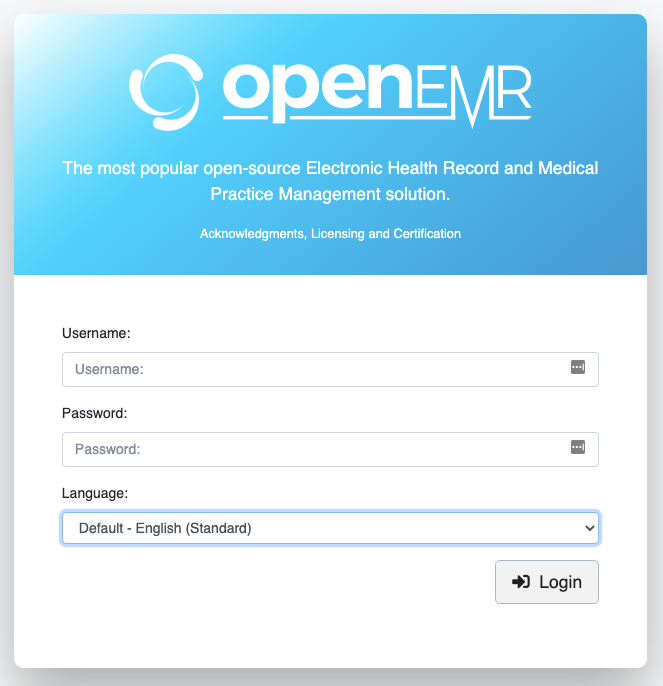
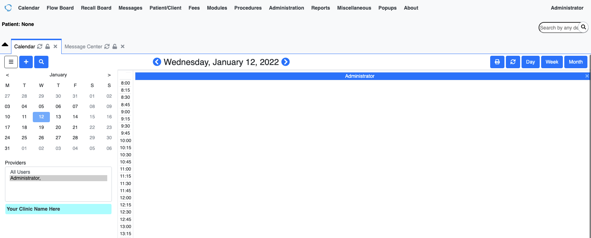

# HLS EMR 

This section details the requirements for deployment and configuration of HLS EHR.

HLS EMR is deployed using docker compose [here](https://github.com/bochoi-twlo/hls-ehr/blob/main/assets/hls-ehr/docker-compose.yml).


## Prerequisites

The following prerequisites must be satisfied prior to installing the application.

### Docker Desktop

Install Docker desktop that includes docker compose CLI will be used to run the application installer locally on your machine.
Goto [Docker Desktop](https://www.docker.com/products/docker-desktop) and install with default options.
After installation make sure to start Docker desktop.

### jq & xq

```shell
$ brew install jq           # install jq
...
$ jq --version              # confirm installation
jq-1.6
$ brew install python-yq    # install yq/xq
...
$ yq --version              # confirm installation
yq 2.13.0
```

### ngrok, optional

If you will demo a blue print that will need to connect back to your macbook from the internet (e.g., "patient appointment management"), you need to install a reverse proxy.

Download ngrok from `https://ngrok.com/download`

Follow instruction from ngrok to unzip (FYI, there is internal initiative to get enterprise license for ngrok that will assign static URL, will update this when it is place)

Drag the `ngrok` application into your `/Applications` folder

### Allow Chrome Insecure localhost Connection

OpenEMR & Mirth run over the insecure http (as opposed to certificate backed https), we recommend that you use chrome and allow chrome to open connections to insecure localhost.

In a new chrome tab, open `chrome://flags/#allow-insecure-localhost` and set the option to enabled on `allow-insecure-localhost`.
Note that this will re-launch chrome.


## Deploy HLS-EHR

### Clean-up Previous Installation
If you already have a previous `hls-ehr` docker compose application running or are updating to a new version of docker stack,

- Open Docker dashboard, select `Containers/Apps`, locate previous `hls-ehr` application
- Click the `Delete` trash can button on the application
- Click `Remove` in the 'Remove application' dialog
- Wait for application to be completely removed
- Delete the volumes
- 
```shell
$ docker volume prune
WARNING! This will remove all local volumes not used by at least one container.
Are you sure you want to continue? [y/N] y
...
Total reclaimed space: 179.2MB
```

### Install HLS-EHR Docker Compose

1. Download `docker-compose.yml` from github: 
[download](https://raw.githubusercontent.com/bochoi-twlo/hls-ehr/main/assets/hls-ehr/docker-compose.yml).

2. Launch a fresh instance of `hls-ehr` docker compose stack.

```shell
$ docker-compose --project-name hls-ehr up -d
[+] Running 12/12
Creating network "hls-ehr_default" with the default driver
Creating volume "hls-ehr_v_openemr_log" with default driver
Creating volume "hls-ehr_v_openemr_site" with default driver
Creating volume "hls-ehr_v_openemr_db" with default driver
Creating volume "hls-ehr_v_openemr_ie_app" with default driver
Creating volume "hls-ehr_v_mirth_app" with default driver
Creating openemr_ie_db ... done
Creating openemr_db    ... done
Creating mirth_db      ... done
Creating openemr_app   ... done
Creating openemr_ie    ... done
Creating mirth_app     ... done
```

Examine the docker dashboard and check that all 6 docker containers are running (i.e., green) like below.




### Validate Installation

#### OpenEMR

- Open http://localhost:80/


- Select 'No Thanks' in registration window 


- Login using credentials `admin/pass` 


- OpenEMR Calender pane will display initially 